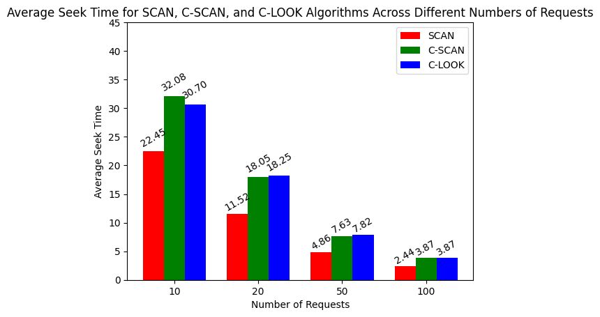
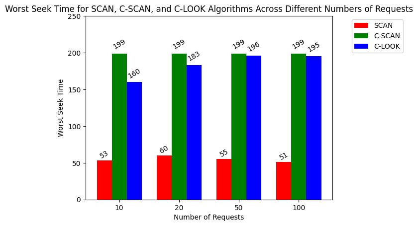
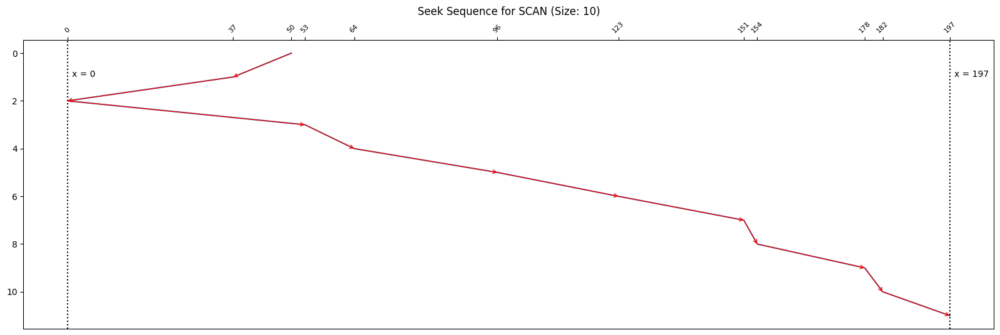
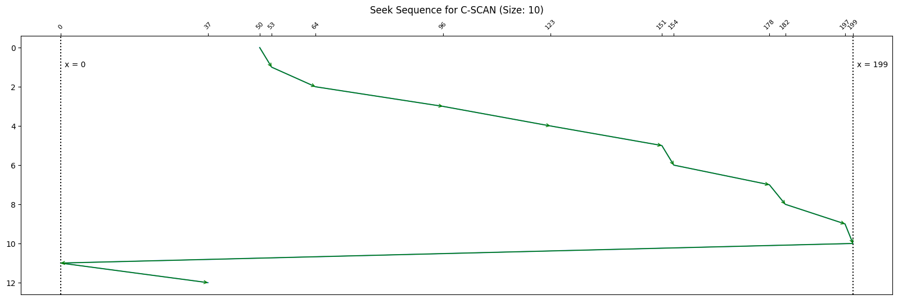
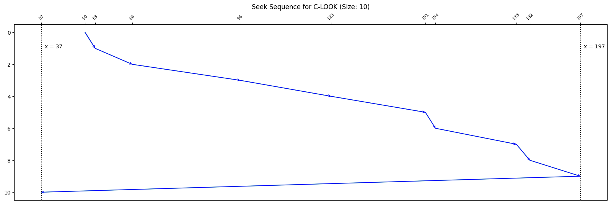

# 📀Disk Scheduling Algorithms Simulation 💿
In the world of computers, smooth operation relies heavily on efficient management of data access. This is where disk scheduling comes in, playing a vital role in ensuring the optimal performance of your system. Disk scheduling, handled by the operating system, involves organizing and prioritizing requests for data transfer to and from the disk drive. Operating systems employ various disk scheduling algorithms to achieve optimal performance. Some of the most common ones include FCFS (First Come First Served), SSTF (Shortest Seek Time First), SCAN, C-SCAN (Circular SCAN), C-LOOK (Circular LOOK) and FSCAN.

This Jupyter Notebook (CST232-Asg2.ipynb) simulates and compares the performance of three disk scheduling algorithms: SCAN, C-SCAN, and C-LOOK. Disk scheduling is a crucial aspect of operating systems, and this simulation helps analyze the average and worst-case seek times for different numbers of random disk requests.

## Table of Contents
- [Introduction](#introduction)
- [Usage](#usage)
- [Results](#results)
- [Visualizations](#visualizations)
- [Screenshots](#screenshots)

## Introduction

This project implements three disk scheduling algorithms and evaluates their performance based on average and worst-case seek times. The implemented algorithms are:
- SCAN
- C-SCAN
- C-LOOK

The simulation is implemented as a Jupyter Notebook, allowing users to interactively specify the disk size, initial head position, direction, and different numbers of random disk requests. The results are then analyzed and visualized to compare the performance of each algorithm.

## Usage

1. Clone the repository:

   ```bash
   git clone https://github.com/danishayman/cst232-asg2
   cd cst232-asg2
   ```

2. Install the required dependencies:
    ```bash
    pip install matplotlib numpy
    ```

3. Install Jupyter: 
    ```bash
    pip install jupyter
    ```

4. Open the Jupyter Notebook:
    ```bash
    jupyter-notebook CST232-Asg2.ipynb
    ```

5. Inside the Jupyter Notebook, run the cells to execute the simulation.

6. View the results and visualizations directly within the notebook.

7. Feel free to change the following values in the Initialization according to your needs:
   - `head`: The initial head position.
   - `direction`: The direction of head movement ( "left" / "right" ).
   - `random_request`: The number of random disk requests.
   - `disk_size`: The size of the disk.

## Results
The notebook generates average and worst-case seek times for each algorithm across different numbers of random disk requests. The results are displayed within the notebook.

It also visualizes the order of disk requests processed by a disk scheduling algorithm, making it easier to understand and analyze the algorithm's behavior. The arrows and annotations help illustrate the sequential movement of the disk head during the seek operation.

## Visualizations

The Jupyter Notebook generates interactive visualizations to analyze the performance of the disk scheduling algorithms. These visualizations include:

- Bar charts comparing the average and worst-case seek times for SCAN, C-SCAN, and C-LOOK algorithms across various request sizes.
- Line charts with arrows indicating the order of disk requests, visualizing the seek sequences for each algorithm and request size.

These visualizations provide a clear understanding of the behavior and efficiency of each disk scheduling algorithm.
The notebook produces interactive visualizations, including bar charts to compare the average and worst-case seek times for SCAN, C-SCAN, and C-LOOK algorithms across various request sizes.

Additionally, seek sequences for each algorithm and request size are visualized using line charts with arrows indicating the order of disk requests.


## Screenshots










